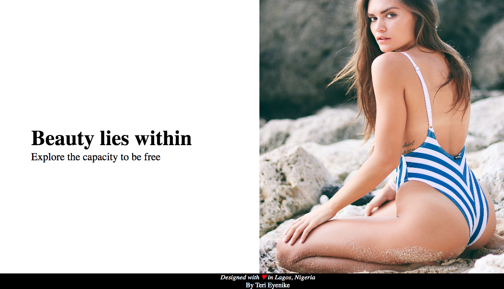

# Project Title

Distortion hover effect using WebGL

# Motivation for this project

The inspiration for this project came from the fact I want to create a displacement effect for the web using hover effect that reveals the next image underneath.

# Snapshot for the project

# Preview for the project

# Getting Started

You need to have basic understanding of HTML, CSS, and Javascript. This project was build using external javascript from the following.

1. Hover effect from [Robin Dela](https://github.com/robin-dela/hover-effect/blob/master/dist/hover-effect.umd.js)

* The library that creates the actual effect

2. [Three.js](https://cdnjs.cloudflare.com/ajax/libs/three.js/106/three.min.js)

* A WebGL library that the hover-effect library uses for the distortion

3. [TweenMax](https://cdnjs.cloudflare.com/ajax/libs/gsap/2.1.3/TweenMax.min.js)

* A GSAP library that allows the hover-effect library to create the fade animation

To use this external source code,

- [x] Embed them in your script tag before the closing body tag.

# Deployment

[Netlify](https://app.netlify.com)

# Author

Teri Eyenike

Follow me on social

[Twitter](https://twitter.com/terieyenike)

[Github](https://github.com/terieyenike)

Follow the link to view this project, below

[displacement](https://displacement.netlify.com/)